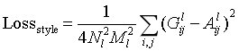
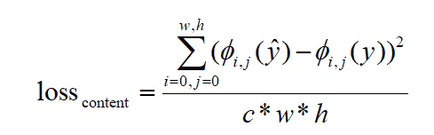
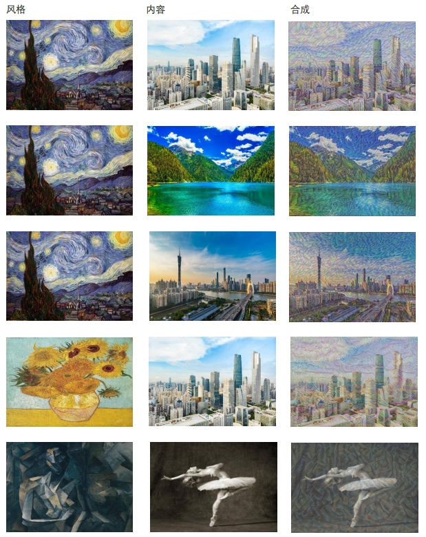
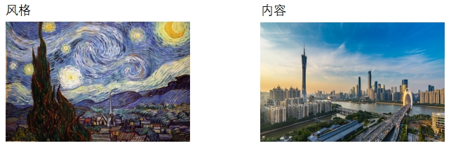
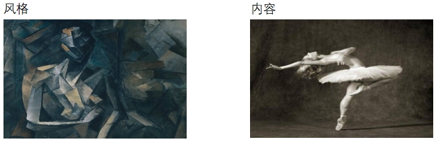

### 具体实现

#### 导入库和设置参数

包含所需的库导入、图像尺寸和训练参数的设置。

```python
import tensorflow.compat.v1 as tf
tf.disable_v2_behavior()
import numpy as np
import scipy.io
import cv2
import scipy.misc

HEIGHT = 300          #图像的高度
WIGHT = 450           #图像的宽度
LEARNING_RATE = 1.0   #优化器的学习率
NOISE = 0.5           #噪声比例
ALPHA = 1             #用于调整内容损失的加权因子
BETA = 100            #用于调整风格损失的加权因子
TRAIN_STEPS = 200     #训练步数
OUTPUT_IMAGE = "E:/vgg/python/img"   #生成图像的输出路径
STYLE_LAUERS = [('conv1_1', 0.2), ('conv2_1', 0.2), ('conv3_1', 0.2), ('conv4_1', 0.2), ('conv5_1', 0.2)]
#定义了用于计算风格损失的 VGG 层及其权重
CONTENT_LAYERS = [('conv4_2', 0.5), ('conv5_2',0.5)]
#定义了用于计算内容损失的 VGG 层及其权重
```

#### VGG-19 模型的定义

定义了VGG-19模型，加载了预训练的权重文件 `imagenet-vgg-verydeep-19.mat`。

根据VGG-19模型的结构重新创建一个结构相同的神经网络，提取出已经训练好的参数作为新的网络的参数。

```python
def vgg19():
    layers=(
        'conv1_1','relu1_1','conv1_2','relu1_2','pool1',
        'conv2_1','relu2_1','conv2_2','relu2_2','pool2',
        'conv3_1','relu3_1','conv3_2','relu3_2','conv3_3','relu3_3','conv3_4','relu3_4','pool3',
        'conv4_1','relu4_1','conv4_2','relu4_2','conv4_3','relu4_3','conv4_4','relu4_4','pool4',
        'conv5_1','relu5_1','conv5_2','relu5_2','conv5_3','relu5_3','conv5_4','relu5_4','pool5'
    )
    vgg = scipy.io.loadmat('E:/imagenet-vgg-verydeep-19.mat')
    weights = vgg['layers'][0]

    network={}
    net = tf.Variable(np.zeros([1, 300, 450, 3]), dtype=tf.float32)
    network['input'] = net
    for i,name in enumerate(layers):
        layer_type=name[:4]
        if layer_type=='conv':
            kernels = weights[i][0][0][0][0][0]
            bias = weights[i][0][0][0][0][1]
            conv=tf.nn.conv2d(net,tf.constant(kernels),strides=(1,1,1,1),padding='SAME',name=name)
            net=tf.nn.relu(conv + bias)
        elif layer_type=='pool':
            net=tf.nn.max_pool(net,ksize=(1,2,2,1),strides=(1,2,2,1),padding='SAME')
        network[name]=net
    return network
```

#### Gram 矩阵计算：

计算输入特征图的 Gram 矩阵，用于风格损失的计算。

```python
def gram(x, size, deep):
    x = tf.reshape(x, (size, deep))
    g = tf.matmul(tf.transpose(x), x)
    return g
```

#### 定义损失函数

##### 风格损失计算

计算风格损失，包括特定层的 Gram 矩阵的差异。

设卷积层的高度和宽度分别为N和M,则有：



函数参数：sess：TensorFlow 会话；style_neck：风格图像的特征图；model：当前的模型。

```python
def style_loss(sess, style_neck, model):
    style_loss = 0.0
    for layer_name, weight in STYLE_LAUERS:
        # 计算特征矩阵
        a = style_neck[layer_name]
        x = model[layer_name]
        # 长x宽
        M = a.shape[1] * a.shape[2]
        N = a.shape[3]
        # 计算gram矩阵
        A = gram(a, M, N)
        G = gram(x, M, N)
        # 根据公式计算损失，并进行累加
        style_loss += (1.0 / (4 * M * M * N * N)) * tf.reduce_sum(tf.pow(G - A, 2)) * weight
        # 将损失对层数取平均
    style_loss /= len(STYLE_LAUERS)
    return style_loss
```

##### 内容损失计算

计算内容损失，包括特定层的特征图的差异。

假设求得的特征矩阵是φ(y)，生成图片求得的特征矩阵为φ(y^)，且c=φ.channel，w=φ.weight，h=φ.height，则有：



函数参数：sess：TensorFlow 会话；style_neck：风格图像的特征图；model：当前的模型。

```python
def content_loss(sess, content_neck, model):
    content_loss = 0.0
    # 逐个取出衡量内容损失的vgg层名称及对应权重
    for layer_name, weight in CONTENT_LAYERS:
        # 计算特征矩阵
        p = content_neck[layer_name]
        x = model[layer_name]
        # 长x宽xchannel
        M = p.shape[1] * p.shape[2]
        N = p.shape[3]
        lss = 1.0 / (M * N)
        content_loss += lss * tf.reduce_sum(tf.pow(p - x, 2)) * weight
        # 根据公式计算损失，并进行累加
    # 将损失对层数取平均
    content_loss /= len(CONTENT_LAYERS)
    return content_loss
```

#### 随机生成图像

生成带有噪声的图像，作为优化的起始点。

NOISE数值为噪声比例，初始定为0.5。

```python
def random_img(height, weight, content_img):
    noise_image = np.random.uniform(-20, 20, [1, height, weight, 3])
    random_img = noise_image * NOISE + content_img * (1 - NOISE)
    return random_img
```

#### 获取特征图

获取内容图和风格图的特征图，用于后续的损失计算。

由于计算风格特征和内容特征时数据都不会改变，所以为了节省训练时间，在训练之前先计算出特征结果，封装在get_neck()函数中。

通过这个过程，我们能够从模型中抽取指定层的特征，用于度量内容和风格之间的差异。

```python
def get_neck(sess, model, content_img, style_img):
    sess.run(tf.compat.v1.assign(model['input'], content_img))
    # sess.run(tf.assign(model['input'], content_img))
    # Tensorflow 2.0版本中已经移除了Session这一模块
    content_neck = {}
    for layer_name, weight in CONTENT_LAYERS:
        # 计算特征矩阵
        p = sess.run(model[layer_name])
        content_neck[layer_name] = p
    sess.run(tf.compat.v1.assign(model['input'], style_img))
    # sess.run(tf.assign(model['input'], style_img))
    style_content = {}
    for layer_name, weight in STYLE_LAUERS:
        # 计算特征矩阵
        a = sess.run(model[layer_name])
        style_content[layer_name] = a
    return content_neck, style_content
```

#### 主函数

1. **定义 VGG-19 模型：**
   - 使用 `vgg19()` 函数定义 VGG-19 模型，用于提取图像的特征。
2. **读取内容图像和风格图像：**
   - 使用 OpenCV 读取内容图像和风格图像，并进行预处理。
3. **生成带有噪声的图像：**
   - 使用 `random_img` 函数生成带有噪声的图像，作为优化算法的起始点。
4. **初始化 TensorFlow 会话：**
   - 使用 `tf.compat.v1.Session()` 创建 TensorFlow 会话。
5. **获取内容图像和风格图像的特征：**
   - 使用 `get_neck` 函数获取内容图像和风格图像在 VGG-19 模型中的中间层特征图。
6. **定义损失函数和优化器：**
   - 使用 `content_loss` 和 `style_loss` 函数计算内容损失和风格损失。
   - 定义总体损失函数，结合了内容损失和风格损失。
   - 使用 Adam 优化器最小化总体损失。
7. **初始化变量和设置初始图像：**
   - 运行 TensorFlow 操作，初始化变量。
   - 将模型的输入设置为带有噪声的图像。
8. **训练循环：**
   - 使用优化器迭代调整生成图像，最小化总体损失。
   - 梯度下降算法迭代优化
   - 每隔一定步数保存生成的图像到指定路径。
9. **保存最终生成的图像：**
   - 将生成的图像还原到合适的像素范围（0-255）。
   - 将最终生成的图像保存到指定路径。

```python
def main():
    model = vgg19()
    content_img = cv2.imread('E:/vgg/img/rainier3.jpg')
    content_img = cv2.resize(content_img, (450, 300))
    content_img = np.reshape(content_img, (1, 300, 450, 3)) - [128.0, 128.2, 128.0]   
    #图像预处理 减去均值的操作可以有助于提高模型的训练稳定性
    style_img = cv2.imread('E:/vgg/img/autumn-oak.jpg')
    style_img = cv2.resize(style_img, (450, 300))
    style_img = np.reshape(style_img, (1, 300, 450, 3)) - [128.0, 128.2, 128.0]

    # 生成图片
    rand_img = random_img(HEIGHT, WIGHT, content_img)

    tf.compat.v1.disable_eager_execution()
    with tf.compat.v1.Session() as sess:
        # 计算loss值
        content_neck, style_neck = get_neck(sess, model, content_img, style_img)  #获取内容图像和风格图像的特征图
        cost = ALPHA * content_loss(sess, content_neck, model) + BETA * style_loss(sess, style_neck, model)
        #计算总的loss
        optimizer = tf.train.AdamOptimizer(LEARNING_RATE).minimize(cost)

        sess.run(tf.global_variables_initializer())
        sess.run(tf.assign(model['input'], rand_img))
        # 梯度下降算法迭代优化
        for step in range(TRAIN_STEPS):
            print(step)
            # 训练
            sess.run(optimizer)
            if step % 10 == 0:
                img = sess.run(model['input'])
                img += [128, 128, 128]
                img = np.clip(img, 0, 255).astype(np.uint8)
                name = OUTPUT_IMAGE + "//" + str(step) + ".jpg"
                img = img[0]
                cv2.imwrite(name, img)

        img = sess.run(model['input'])
        img += [128, 128, 128]
        img = np.clip(img, 0, 255).astype(np.uint8)
        cv2.imwrite("E:/vgg/end.jpg", img[0])
```


### 训练结果



##### 改变ALPHA、BETA比例结果图



| ALPHA | BETA  |                     结果                     |
| :---: | :---: | :------------------------------------------: |
| 10000 |   1   |  |
|  100  |   1   |    |
|   1   |   1   |      |
|   1   |  100  |    |
|   1   | 10000 |  |

​                                                                                                                                                                                                                                                                                                                                                                                                                                                                                                                                                                                                                                                                                                                                                                                                                                                                                                                                                                                                                                                                                                                                                                                                                                                                                                                                                                                                                                                                                                                                                                                                                                                                                                                                                                                                                                                                                                                                                                                                                                                                                                                                                                                                                                                                                                                                                                                 

| ALPHA | BETA  |                  结果                   |
| :---: | :---: | :-------------------------------------: |
| 10000 |   1   |  |
|  100  |   1   |    |
|   1   |   1   |      |
|   1   |  100  |    |
|   1   | 10000 |  |

