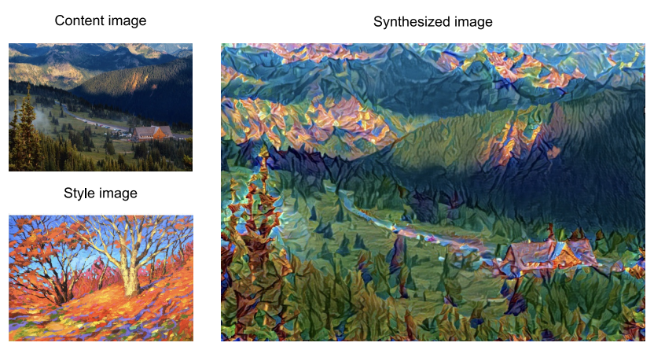
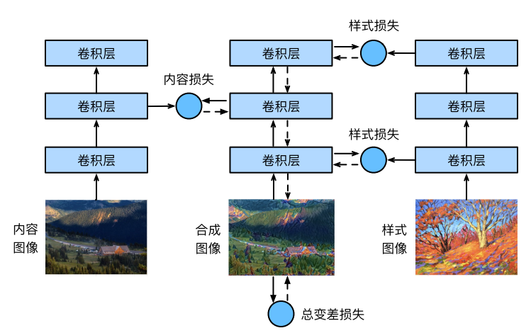

# 课外实验——图像风格迁移

## 简介

使用卷积神经网络，自动将一个图像中的风格应用在另一图像之上，即风格迁移（style trans‐fer）(Gatys et al., 2016)。

这里我们需要两张输入图像：一张是内容图像，另一张是风格图像。我们将使用神经网络修改内容图像，使其在风格上接近风格图像。

如下图所示



## 原理

### 步骤

- 初始化合成图像，该合成图像是风格迁移过程中唯一需要更新的变量
- 选择一个预训练的卷积神经网络来抽取图像的特征，模型参数无须更新
- 选择其中某些层的输出作为内容特征或风格特征
- 通过前向传播计算风格迁移的损失函数
- 通过反向传播迭代模型参数，即不断更新合成图像
- 模型训练结束时，输出风格迁移的模型参数，得到最终的合成图像

> 其中卷积神经网络，以下图为例，这里选取的预训练的神经网络含有3个卷积层，其中第二层输出内容特征，第一层和第三层输出风格特征



### 具体实现

#### 读取内容和风格图像

> 其中内容图像和风格图像尺寸并不需要一致

```python
%matplotlib inline
import torch
import torchvision
from torch import nn
from d2l import torch as d2l

#内容图像
d2l.set_figsize()
content_img = d2l.Image.open('../img/rainier.jpg')
d2l.plt.imshow(content_img);

#风格图像
style_img = d2l.Image.open('../img/autumn-oak.jpg')
d2l.plt.imshow(style_img);
```

#### 图像的预处理和后处理

> 预处理函数`preprocess()`

对输入图像在RGB三个通道分别做标准化，并将结果变换成卷积神经网络接受的输入格式

```python
rgb_mean = torch.tensor([0.485, 0.456, 0.406])
rgb_std = torch.tensor([0.229, 0.224, 0.225])
```

```python
def preprocess(img, image_shape):
    transforms = torchvision.transforms.Compose([
      torchvision.transforms.Resize(image_shape),
      torchvision.transforms.ToTensor(),
      torchvision.transforms.Normalize(mean=rgb_mean, std=rgb_std)])
    return transforms(img).unsqueeze(0)
```

> 后处理函数`postprocess()`

将输出图像中的像素值还原回标准化之前的值。

由于图像打印函数要求每个像素的浮点数值在0～1之间对小于0和大于1的值分别取0和1。

```python
def postprocess(img):
    img = img[0].to(rgb_std.device)
    img = torch.clamp(img.permute(1, 2, 0) * rgb_std + rgb_mean, 0, 1)
    return torchvision.transforms.ToPILImage()(img.permute(2, 0, 1))
```

#### 抽取图像特征

我们使用基于ImageNet数据集预训练的VGG‐19模型来抽取图像特征

```python
pretrained_net = torchvision.models.vgg19(pretrained=True)
```

> VGG网络使用了5个卷积块。实验中，我们选择第四卷积块的最后一个卷积层作为内容层，选择每个卷积块的第一个卷积层作为风格层。

```python
style_layers, content_layers = [0, 5, 10, 19, 28], [25]
net = nn.Sequential(*[pretrained_net.features[i] for i in range(max(content_layers + style_layers) + 1)])
```

<br/>

由于我们还需要中间层的输出，因此这里我们逐层计算，并保留内容层和风格层的输出

```python
def extract_features(X, content_layers, style_layers):
    contents = []
    styles = []
    for i in range(len(net)):
        X = net[i](X)
        if i in style_layers:
            styles.append(X)
        if i in content_layers:
            contents.append(X)
    return contents, styles
```

下面定义两个函数：`get_contents()`函数对内容图像抽取内容特征；`get_styles()`函数对风格图像抽取风格特征。

```python
def get_contents(image_shape, device):
    content_X = preprocess(content_img, image_shape).to(device)
    contents_Y, _ = extract_features(content_X, content_layers, style_layers)
    return content_X, contents_Y

def get_styles(image_shape, device):
    style_X = preprocess(style_img, image_shape).to(device)
    _, styles_Y = extract_features(style_X, content_layers, style_layers)
    return style_X, styles_Y
```

#### 定义损失函数

> 风格迁移的损失函数，由内容损失、风格损失和全变分损失3部分组成

##### 内容损失

内容损失通过平方误差函数衡量合成图像与内容图像在内容特征上的差异。平方误差函数的两个输入均为`extract_features`函数计算所得到的内容层的输出。

```python
def content_loss(Y_hat, Y):
    # 我们从动态计算梯度的树中分离目标：
    # 这是一个规定的值，而不是一个变量。
    return torch.square(Y_hat - Y.detach()).mean()
```

##### 风格损失

通过平方误差函数衡量合成图像与风格图像在风格上的差异。为了表达风格层输出的风格，我们先通过`extract_features`函数计算风格层的输出。

```python
def gram(X):
    num_channels, n = X.shape[1], X.numel() // X.shape[1]
    X = X.reshape((num_channels, n))
    return torch.matmul(X, X.T) / (num_channels * n)
```

自然地，风格损失的平方误差函数的两个格拉姆矩阵输入分别基于合成图像与风格图像的风格层输出。这里假设基于风格图像的格拉姆矩阵`gram_Y`已经预先计算好了。

```python
def style_loss(Y_hat, gram_Y):
    return torch.square(gram(Y_hat) - gram_Y.detach()).mean()
```

##### 全变分损失

有时候，我们学到的合成图像里面有大量高频噪点，即有特别亮或者特别暗的颗粒像素。一种常见的去噪方法是全变分去噪（total variation denoising），能够尽可能使邻近的像素值相似。

假设xi,j表示坐标(i, j)处的像素值，降低全变分损失：$$Xi,j|xi,j − xi+1,j | + |xi,j − xi,j+1|$$

```python
def tv_loss(Y_hat):
    return 0.5 * (torch.abs(Y_hat[:, :, 1:, :] - Y_hat[:, :, :-1, :]).mean() + 
                  torch.abs(Y_hat[:, :, :, 1:] - Y_hat[:, :, :, :-1]).mean())
```

##### 损失函数

风格转移的损失函数是内容损失、风格损失和总变化损失的加权和。通过调节这些权重超参数，我们可以权衡合成图像在保留内容、迁移风格以及去噪三方面的相对重要性。

```python
content_weight, style_weight, tv_weight = 1, 1e3, 10

def compute_loss(X, contents_Y_hat, styles_Y_hat, contents_Y, styles_Y_gram):
    # 分别计算内容损失、风格损失和全变分损失
    contents_l = [content_loss(Y_hat, Y) * content_weight for Y_hat, Y in zip(contents_Y_hat, contents_Y)]
    styles_l = [style_loss(Y_hat, Y) * style_weight for Y_hat, Y in zip(styles_Y_hat, styles_Y_gram)]
    tv_l = tv_loss(X) * tv_weight
    
    # 对所有损失求和
    l = sum(10 * styles_l + contents_l + [tv_l])
    return contents_l, styles_l, tv_l, l
```

#### 初始化合成图像

在风格迁移中，合成的图像是训练期间唯一需要更新的变量。因此，我们可以定义一个模型SynthesizedImage，并将合成的图像视为模型参数。

```python
class SynthesizedImage(nn.Module):
    def __init__(self, img_shape, **kwargs):
        super(SynthesizedImage, self).__init__(**kwargs)
        self.weight = nn.Parameter(torch.rand(*img_shape))
        
    def forward(self):
        return self.weight
```

定义get_inits函数。该函数创建了合成图像的模型实例，并将其初始化为图像X。风格图像在各个风格层的格拉姆矩阵styles_Y_gram将在训练前预先计算好。

```python
def get_inits(X, device, lr, styles_Y):
    gen_img = SynthesizedImage(X.shape).to(device)
    gen_img.weight.data.copy_(X.data)
    trainer = torch.optim.Adam(gen_img.parameters(), lr=lr)
    styles_Y_gram = [gram(Y) for Y in styles_Y]
    return gen_img(), styles_Y_gram, trainer
```

#### 训练模型

在训练模型进行风格迁移时，我们不断抽取合成图像的内容特征和风格特征，然后计算损失函数

```python
def train(X, contents_Y, styles_Y, device, lr, num_epochs, lr_decay_epoch):
    X, styles_Y_gram, trainer = get_inits(X, device, lr, styles_Y)
    scheduler = torch.optim.lr_scheduler.StepLR(trainer, lr_decay_epoch, 0.8)
    animator = d2l.Animator(xlabel='epoch', ylabel='loss',
                            xlim=[10, num_epochs],
                            legend=['content', 'style', 'TV'],
                            ncols=2, figsize=(7, 2.5))
    for epoch in range(num_epochs):
        trainer.zero_grad()
        contents_Y_hat, styles_Y_hat = extract_features(
            X, content_layers, style_layers)
        contents_l, styles_l, tv_l, l = compute_loss(
            X, contents_Y_hat, styles_Y_hat, contents_Y, styles_Y_gram)
        l.backward()
        trainer.step()
        scheduler.step()
        if (epoch + 1) % 10 == 0:
          animator.axes[1].imshow(postprocess(X))
          animator.add(epoch + 1, [float(sum(contents_l)),
                                   float(sum(styles_l)), float(tv_l)])
    return X
```

首先将内容图像和风格图像的高和宽分别调整为300和450像素，用内容图像来初始化合成图像。

```python
device, image_shape = d2l.try_gpu(), (300, 450)
net = net.to(device)
content_X, contents_Y = get_contents(image_shape, device)
_, styles_Y = get_styles(image_shape, device)
output = train(content_X, contents_Y, styles_Y, device, 0.3, 500, 50)
```

#### 训练结果