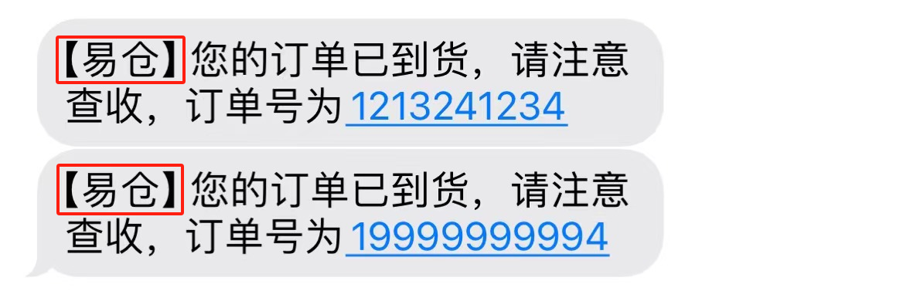
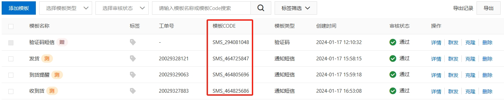
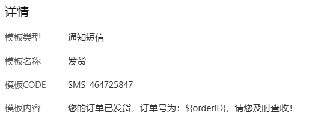
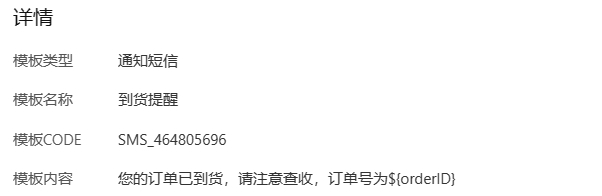

# 短信服务使用说明

## 1、使用前提

#### 安装SDK

SDK 包名称：com.aliyun/dysmsapi20170525

SDK包版本：2.0.24

SDK 包管理平台：maven

SDK 安装命令

```java
<dependency>
  <groupId>com.aliyun</groupId>
  <artifactId>dysmsapi20170525</artifactId>
  <version>2.0.24</version>
</dependency>
```

#### 环境要求

- 最低要求Java 8

## 2、代码讲解

#### 步骤介绍

1、初始化配置对象 com.aliyun.teaopenapi.models.Config 。 Config 对象存放 AccessKeyId、AccessKeySecret 、endpoint 等配置，Endpoint 如示例中的 dysmsapi.aliyuncs.com 。

```java
Config config = new Config()
    // 您的AccessKey ID
    .setAccessKeyId(accessKeyId)
    // 您的AccessKey Secret
    .setAccessKeySecret(accessKeySecret);
// 访问的域名
config.endpoint = "dysmsapi.aliyuncs.com";
```

2、实例化一个客户端，从 com.aliyun.dysmsapi20170525.Client 类生成对象 client 。 后续 request、response 从 com.aliyun.dysmsapi20170525.models 中获得。

```java
Client client = new Client(config);
```

3、创建对应 API 的 Request 。 类的命名规则为 API 方法名加上 Request 。例如：

```java
SendSmsRequest request = new SendSmsRequest();
```

4、设置请求类 request 的参数。 通过 request 类的属性设置必要的信息，即 API 中必须要提供的信息。

复制

```java
request.PhoneNumbers = "your_value"; // 该参数值为假设值，请您根据实际情况进行填写

request.SignName = "your_value"; // 该参数值为假设值，请您根据实际情况进行填写
```

5、通过 client 对象获得对应 request 响应 response 。

```java
SendSmsResponse response = client.sendSms(request);
System.out.println(new Gson().toJson(response.Body));
```

6、调用 response 中对应的属性获得返回的参数值。 假设您需要获取 requestId ：

```java
String requestId = response.Body.requestId;
```

7、使用 catch() 处理报错。

```java
catch (Exception e) {
    e.printStackTrace();
}
```

#### 参数介绍


##### SignName

签名，即是短信的标题(红框内容)，目前只申请了“易仓”。



##### TemplateCode

短信模板 Code可以通过短信服务控制台添加模板，模板通过审核后，才可使用模板 Code。



##### PhoneNumbers 

接收短信的手机号码。发送测试短信的手机号，需要先在控制台绑定测试手机号后才可使用。支持对多个手机号码发送短信，手机号码之间以半角逗号（,）分隔。上限为 1000 个手机号码。批量调用相对于单条调用及时性稍有延迟。示例值:17816180499


##### TemplateParam

短信模板变量对应的实际值，支持传入多个参数（需要提前申请好模板）。各个模板所需参数如下三图。






## 3、测试结果

#### 1、发货

##### 参数设置

```java
com.aliyun.dysmsapi20170525.models.SendSmsRequest sendSmsRequest = new com.aliyun.dysmsapi20170525.models.SendSmsRequest()
                .setSignName("易仓")
                .setTemplateCode("SMS_464725847")
                .setPhoneNumbers("17816180499")
                .setTemplateParam("{\"orderID\":\"88888888888\"}");
```

##### 运行结果


#### 2、到货提醒

##### 参数设置

```java
com.aliyun.dysmsapi20170525.models.SendSmsRequest sendSmsRequest = new com.aliyun.dysmsapi20170525.models.SendSmsRequest()
                .setSignName("易仓")
                .setTemplateCode("SMS_464805696")
                .setPhoneNumbers("17816180499")
                .setTemplateParam("{\"orderID\":\"19999999994\"}");
```

##### 运行结果


#### 3、收到货

```java
com.aliyun.dysmsapi20170525.models.SendSmsRequest sendSmsRequest = new com.aliyun.dysmsapi20170525.models.SendSmsRequest()
                .setSignName("易仓")
                .setTemplateCode("SMS_464825686")
                .setPhoneNumbers("17816180499")
//              .setTemplateParam("{\"orderID\":\"88888888888\"}") 不传参，setTemplateParam可有可无
                ;
```

##### 运行结果

